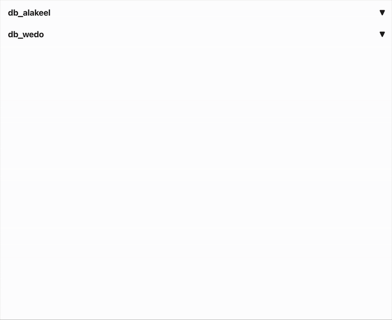

# backup files view
this repository is to to view backed-up files from odoo in a clear and informative UI and also allow user to download it

## to setup
### front-end is created in react
- to setup fron-end navigate **"backup-files-view-react/.env"**
- to test run navigate to **"backup-files-view-react/"** and run `npm install` and `npm run dev`
### back-end is created in node express
- to setup navigate to **"server/.env"** and to test run `npm install` and `node server.js` fro dir **"server"**